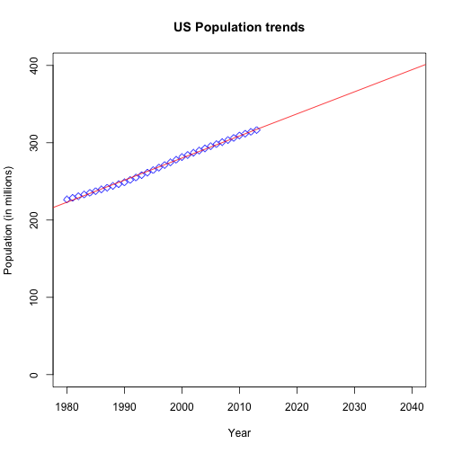

US Population Predictor
========================
author: Gyaan GM
date: 23rd April 2016
autosize: true

Application Description:
=======================

Github: <https://github.com/gkgm/Developing-Data-Products>

<small>
The application uses R code to calculate the future US population between the years 2014 and 2040 using historical population data from the past 34 years (i.e. 1980 to 2013) and linear regression based on those past data points. 

It basically does the following:

- Prompts the user to select a year between 2014 and 2040 (by default 2020 is selected).
- Then draws a scatter plot with the regression line from 1980 to 2040 and indicates future population for the selected year, right on the plot under 'Predicted Population' tab.
- It also displays the historial data in a table, on the 'Historical Population' tab.
- Displays user documentation for this application under 'Read Me' tab.
</small>

Code snippet to extract & clean data:
=====================================
The `getPop()` function in `server.R` extracts and cleans the historical data: 
<small>

```r
library(XML)

getPop <- function() {
#Get the population data from the Internet and parse it out into a data.frame called Pop, then format it's columns
theurl <- "http://www.usgovernmentspending.com/download_multi_year_1980_2013USb_14c2li101mcn_20s"
    tables <- readHTMLTable(theurl)
    n.rows <- unlist(lapply(tables, function(t) dim(t)[1]))
    tables[[which.max(n.rows)]]
    x <- tables$"Government Spending ChartFiscal Years 1980 to 2013"
    Pop <- head(x[,c(1,3)], 34, stringsAsFactors = FALSE)
    colnames(Pop) <- c("Year","Population (in millions)")
    Pop$Year <- round(as.numeric(levels(Pop$Year))[Pop$Year])
    Pop$"Population (in millions)" <- as.numeric(levels(Pop$"Population (in millions)"))[Pop$"Population (in millions)"]
        return (Pop)
}
#Get cached data from the Internet (to save time from reloading data everytime server.R code is called)
Pop <<- getPop()
```
</small>

Code snippet to draw the plot:
===============================



Conclusion:
===========
<small>
This tiny shiny app is just a part of peer assignment on a Data Science Coursera Course - Developing Data Products. The objective of this little application is to predict the population of United States of America based on the given data set.
</small>
